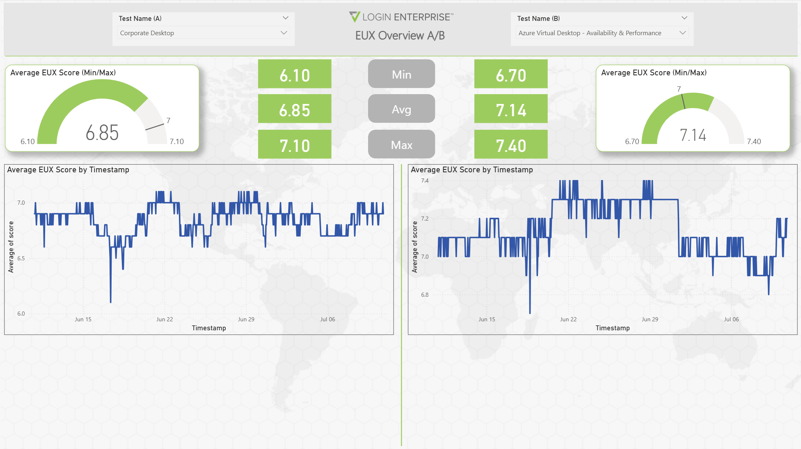

# Login Enterprise Power BI Custom Connector

## Summary

This guide provides step-by-step instructions for setting up and using the **Login Enterprise Power BI custom connector** and also details on the Power BI Template file that is available to leverage dor your Login Enterprise data. You’ll learn how to:

- Install and configure Power BI Desktop
- Download and install the `.mez` connector file
- Enable custom connector support
- Authenticate using your Login Enterprise API token

This connector helps you transform Login Enterprise performance data into actionable insights in Power BI.

> NOTE: The connector is currently setup to use the v7-preview Public API. This API resolves to the same v7 endpoints which is currently the LoginVSI recommended Public API version.

---

## Prerequisites

Ensure the following before starting:

- [Power BI Desktop](https://powerbi.microsoft.com/desktop) is installed
- A valid Login Enterprise API Token
- Your Login Enterprise FQDN (e.g., `demolab.loginvsi.com`)
- To successfully extract data from the Login Enterprise API, the SSL certificate used by the Login Enterprise web interface must be trusted by the machine performing the extraction.
If you are using the default self-signed certificate, you can manually trust the root certificate provided by Login Enterprise.

   You can download the root certificate from the following URL:

   `https://<appliance>/contentDelivery/content/CA.crt`

   Be sure to replace `<appliance>` with the actual FQDN of your Login Enterprise appliance. Once downloaded, install the certificate into the Trusted Root Certification Authorities store on the machine running Power BI and/or the on-prem data gateway machine if performing scheduled refreshes.

## Step 1: Download the Connector

1. Download the `.mez` file from /bin/AnyCPU/Debug : **[LoginEnterprise_PBI.mez](https://github.com/LoginVSI/LE-PBI-Connector/blob/main/bin/AnyCPU/Debug/LE-PBI-Connector.mez)**  
2. Save the file somewhere accessible (e.g., `Downloads`)

## Step 2: Move `.mez` to the Power BI Custom Connectors Folder

Power BI requires custom connectors to be stored in a specific folder.

1. Open File Explorer
2. Navigate to:
   - `Documents\Power BI Desktop\Custom Connectors`
   - _or_, if using OneDrive, try: `OneDrive\Documents\Power BI Desktop\Custom Connectors`
3. If the folder doesn't exist, create it manually
4. Move or copy `LoginEnterprise_PBI.mez` into that folder
5. Restart Power BI Desktop if it was open

## Step 3: Enable Custom Connector Support

1. Open Power BI Desktop
2. Go to **File > Options and settings > Options**
3. Under **Global > Security**, scroll to **Data Extensions**
4. Select:
   - `⚠️ (Not Recommended) Allow any extension to load without validation`
5. Click **OK**
6. Restart Power BI when prompted

## Step 4: Connect to Login Enterprise

1. In Power BI Desktop, click **Get Data > More...**

2. Search for **Login Enterprise**
3. Select it and click **Connect**

4. When prompted:
   - Enter your **FQDN** (e.g., `demolab.loginvsi.com`)
   - Enter your **Login Enterprise API Token** (View documentation [HERE](https://support.loginvsi.com/hc/en-us/articles/360009534760-Public-API) on how to add API access token)
   - Select the **Days Back** from the choices (1, 3, 7, 30, 60, 90). This determines how back data is retrieved by the connector. For example, if selecting 30 days, data will be retrieved going back 30 days to the current date
   - **Use Date Range** – Select TRUE if you want to ignore Days Back and instead use a custom date range.
   - **Start Date** – The beginning date of your custom range (only used if Use Date Range is TRUE).
   - **End Date** – The ending date of your custom range (only used if Use Date Range is TRUE).

   > Note: Either Days Back or Use Date Range must be specified. If both are left blank or set incorrectly, the connector defaults to 30 days.

5. Click **OK**
6. When the authentication prompt appears, click **Connect**

7. In the Navigator:
   - Select the tables you want to load (e.g., Test Runs, Events, Measurements)
   - Click **Load**

> ⏳ Data may take 2–3 minutes to load depending on volume

---

## Data Model Overview

Understanding how the Login Enterprise tables relate to each other is key to building accurate and insightful Power BI reports. This section provides a simple overview of the core relationships between tables and how you can connect them in Power BI:

| From Table              | Field      | To Table              | Field | Relationship  |
|------------------------|------------|------------------------|-------|---------------|
| Test Runs              | `testId`   | Tests              | `id`  | Many-to-One   |
| Measurements           | `testRunId`| Test Runs          | `id`  | Many-to-One   |
| Events                 | `testRunId`| Test Runs          | `id`  | Many-to-One   |
| User Sessions          | `testRunId`| Test Runs          | `id`  | Many-to-One   |
| User Session Metrics   | `testRunId`| Test Runs          | `id`  | Many-to-One   |
| Workload Steps         | `testRunId`| Test Runs          | `id`  | Many-to-One   |
| Aggregated EUX Results | `testRunId`| Test Runs          | `id`  | Many-to-One   |
| Applications           | `id`       | Measurements       | `applicationId`  | Many-to-One   |
| Measurements           | `applicationId`       | Applications       | `id`  | Many-to-One   |
| Events           | `applicationId`       | Applications       | `id`  | Many-to-One   |
| Workload Steps           | `appId`       | Applications       | `id`  | Many-to-One   |

---

## On-Premise Data Gateway

If you choose to publish the Power BI report to the Power BI Service and enable incremental data refresh, you will need to set up an [on-premise data gateway](https://learn.microsoft.com/en-us/power-bi/connect-data/service-gateway-onprem) to allow secure communication between the Power BI Service and your Login Enterprise virtual appliance. This requirement exists because the connector is currently a custom (non-certified) connector, which the Power BI Service cannot access directly without a gateway.

You can find step-by-step instructions for downloading, installing, and configuring the on-premises data gateway [HERE](https://learn.microsoft.com/en-us/data-integration/gateway/service-gateway-install).

---

## Login Enterprise Power BI Template

This Power BI template enables Login Enterprise users to effortlessly visualize and analyze key performance metrics across continuous, load, and application testing. It connects directly to the Login Enterprise API through the custom Power BI connector and delivers ready-to-use dashboards for executive summaries, operational monitoring, and troubleshooting. The report comes fully pre-built with a structured data model, defined schema, and a comprehensive set of interactive visualizations whichc eliminates the need for manual setup. The `.pbit` file can be found in the [/template](https://github.com/LoginVSI/LE-PBI-Connector/tree/main/template) folder

When opening the `.pbit` file, you will be prompted to enter the FQDN (e.g., demolab.loginvsi.com) of the Login Enterprise virtual appliance, an API Token (e.g., Xg0yWyQLAz...) generated from the appliance, and either a Days Back value to retrieve data from a set number of days ago up to the current date, or enable Use Date Range and provide both a Start Date and End Date for a specific time period.

> NOTE: The connector will need to be placed in the Custom Connectors folder of your Power BI Desktop install previously to opening the `.pbit` file as shown above

### Test Name Slicer Behavior

By default, the Test Name slicer will display "All", but selecting "All" will not aggregate data across all tests. To view results, you must select a specific test from the list. This setup is intentional and helps prevent orphaned or inactive test names from appearing in the visuals and slicers throughout the report.

Below is a summary of the pages and their contents of the Login Enterprise template report:

### Summary
- Overview of total test runs and user sessions
- Success rate and average logon time across all tests
- Average EUX score trends by day
- Test run distribution by type (continuous, load, application)
- Daily user session counts broken down by login state (e.g., succeeded, failed, aborted)

### Continuous Testing
- Displays long-term test results to monitor system health, stability, and user experience trends over time
- Tracks average EUX scores, logon time, latency, and resource usage (CPU and memory) by day
- Highlights failures and threshold violations such as login errors, latency spikes, or application crashes
- Helps detect gradual performance regressions, recurring issues, and environmental drift in persistent environments
- Learn more about Login Enterprise [Continuous Testing](https://support.loginvsi.com/hc/en-us/articles/360001310480-Manage-Tests-Continuous-Testing)

### Load Testing
- Displays detailed performance metrics from synthetic load tests, including logon time, EUX score, and VSI Max
- Visualizes session activity over time for CPU, memory, disk queue length, page faults, and other key system metrics
- Tracks application-level performance and failures by measurement type (e.g., app start, document open)
- Highlights average profile load, display protocol responsiveness, and group policy processing to assess user experience under load
- Learn more about Login Enterprise [Load Testing](https://support.loginvsi.com/hc/en-us/articles/360011050640-Manage-Tests-Load-Testing)

### Application Testing
- Displays pre-production image and application validation results across a range of test steps and actions
- Enables detailed analysis of individual app behaviors, including start time, document open time, and browser launch
- Highlights application failures with descriptive error types and affected app names for quick troubleshooting
- Supports change control and post-deployment QA by measuring logon time, latency, and step duration across all tested applications
- Learn more about Login Enterprise [Application Testing](https://support.loginvsi.com/hc/en-us/articles/360012843980-Manage-Tests-Application-Testing)

### Session Metrics Overview
- Compare average CPU and memory usage between two test runs (A and B) across days and time intervals
- Visualize trends over time with daily averages and timestamp-level granularity
- Track min, avg, and max values for both CPU and memory usage to assess consistency and performance stability
- Useful for evaluating performance impact of infrastructure, image, or configuration changes across environments
- Learn more about Login Enterprise [Session Metrics](https://support.loginvsi.com/hc/en-us/articles/9776492249884-Session-Metrics)

### Apps Overview
- Side-by-side comparison of application performance between two selected test runs (A vs. B)
- Visualizes average duration for key application measurements (e.g., app start time, document open) across days
- Bar charts and donut charts show breakdowns by measurement type and app type
- Ideal for A/B testing scenarios such as comparing golden images, application versions, or infrastructure changes
- Learn more about Login Enterprise [Applications](https://support.loginvsi.com/hc/en-us/articles/360001341979-Applications)

### EUX Overview
- Provides a side-by-side comparison of EUX (End User Experience) scores between two selected test runs or environments
- Displays minimum, average, and maximum EUX scores for each test to help evaluate overall user experience quality
- Charts EUX score fluctuations over time to identify degradation, instability, or performance improvements
- Ideal for comparing image optimizations, infrastructure changes, or platform transitions (e.g., on-prem vs. AVD)
- Learn more about Login Enterprise [EUX Score](https://support.loginvsi.com/hc/en-us/articles/4408717958162-Login-Enterprise-EUX-score-and-VSImax)

### Login Metrics
- Compares total logon time performance between two selected test runs across user accounts and time intervals
- Breaks down contributing factors such as display connection time, group policy processing, and profile load
- Visualizes minimum, average, and maximum total logon times, along with trends by timestamp and user
- Identifies slow or failed user sessions to support root cause analysis and image optimization

## Customzing the Login Enterprise Template Report
The template report is fully customizable, allowing customers to tailor it to their unique environment and reporting needs. Users can modify visuals, add custom measures, or integrate additional data sources to align with internal KPIs or business goals. Once finalized, the report can be published to the Power BI Service for automated refreshes, collaboration, and sharing across teams or departments.

- Learn more about [publishing reports from Power BI Desktop](https://learn.microsoft.com/en-us/power-bi/create-reports/desktop-upload-desktop-files)
- Learn how to establish [scheduled data refreshes on the semantic model](https://learn.microsoft.com/en-us/power-bi/connect-data/refresh-scheduled-refresh)

> NOTE: As mentioned previously, the on-premise data gateway will need to be established in order for the published template report to run on its scheduled refresh