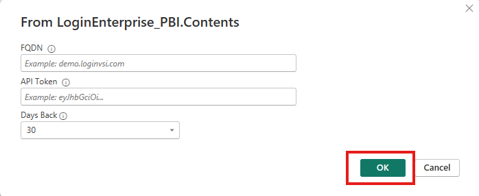
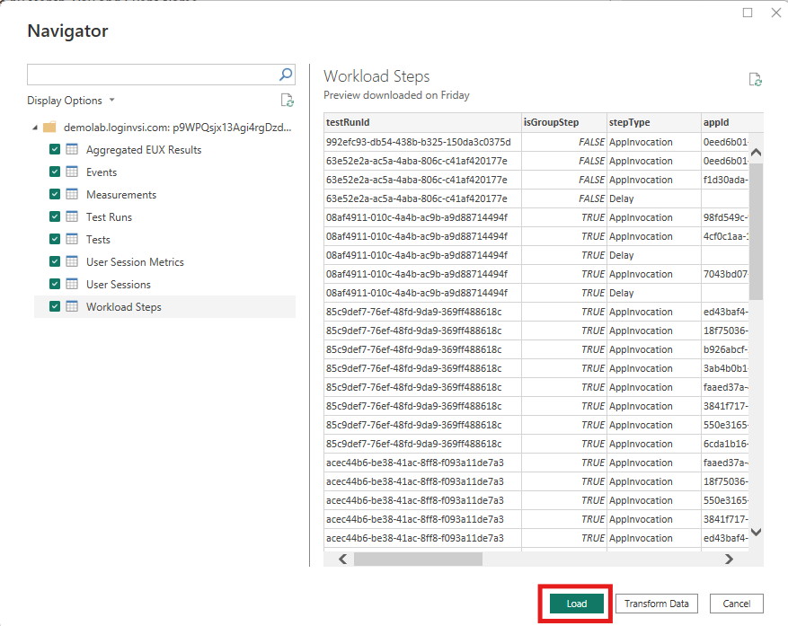

# Login Enterprise Power BI Custom Connector

## Summary

This guide provides step-by-step instructions for setting up and using the **Login Enterprise Power BI custom connector**. You’ll learn how to:

- Install and configure Power BI Desktop
- Download and install the `.mez` connector file
- Enable custom connector support
- Authenticate using your Login Enterprise API token

This connector helps you transform Login Enterprise performance data into actionable insights in Power BI.

---

## Prerequisites

Ensure the following before starting:

- [Power BI Desktop](https://powerbi.microsoft.com/desktop) is installed
- A valid Login Enterprise API Token
- Your Login Enterprise FQDN (e.g., `demolab.loginvsi.com`)

---

## Step 1: Download the Connector

1. Download the `.mez` file from /bin/AnyCPU/Debug : **[LoginEnterprise_PBI.mez](#)**  
2. Save the file somewhere accessible (e.g., `Downloads`)

---

## Step 2: Move `.mez` to the Power BI Custom Connectors Folder

Power BI requires custom connectors to be stored in a specific folder.

1. Open File Explorer
2. Navigate to:
   - `Documents\Power BI Desktop\Custom Connectors`
   - _or_, if using OneDrive, try: `OneDrive\Documents\Power BI Desktop\Custom Connectors`
3. If the folder doesn't exist, create it manually
4. Move or copy `LoginEnterprise_PBI.mez` into that folder
5. Restart Power BI Desktop if it was open

---

## Step 3: Enable Custom Connector Support

1. Open Power BI Desktop
2. Go to **File > Options and settings > Options**
3. Under **Global > Security**, scroll to **Data Extensions**
4. Select:
   - `⚠️ (Not Recommended) Allow any extension to load without validation`
5. Click **OK**
6. Restart Power BI when prompted

---

## Step 4: Connect to Login Enterprise

1. In Power BI Desktop, click **Get Data > More...**

2. Search for **Login Enterprise**
3. Select it and click **Connect**

4. When prompted:
   - Enter your **FQDN** (e.g., `demolab.loginvsi.com`)
   - Enter your **Login Enterprise API Token** (View documentation [HERE](https://support.loginvsi.com/hc/en-us/articles/360009534760-Public-API) on how to add API access token)

5. Click **OK**
6. When the authentication prompt appears, click **Connect**

7. In the Navigator:
   - Select the tables you want to load (e.g., Test Runs, Events, Measurements)
   - Click **Load**

> ⏳ Data may take 2–3 minutes to load depending on volume

---

## Data Model Overview

Understanding how the Login Enterprise tables relate to each other is key to building accurate and insightful Power BI reports. This section provides a simple overview of the core relationships between tables and how you can connect them in Power BI:

| From Table              | Field      | To Table              | Field | Relationship  |
|------------------------|------------|------------------------|-------|---------------|
| Test Runs              | `testId`   | Tests              | `id`  | Many-to-One   |
| Measurements           | `testRunId`| Test Runs          | `id`  | Many-to-One   |
| Events                 | `testRunId`| Test Runs          | `id`  | Many-to-One   |
| User Sessions          | `testRunId`| Test Runs          | `id`  | Many-to-One   |
| User Session Metrics   | `testRunId`| Test Runs          | `id`  | Many-to-One   |
| Workload Steps         | `testRunId`| Test Runs          | `id`  | Many-to-One   |
| Aggregated EUX Results | `testRunId`| Test Runs          | `id`  | Many-to-One   |
| Applications           | `id`       | Measurements       | `applicationId`  | Many-to-One   |
| Measurements           | `applicationId`       | Applications       | `id`  | Many-to-One   |
| Events           | `applicationId`       | Applications       | `id`  | Many-to-One   |
| Workload Steps           | `appId`       | Applications       | `id`  | Many-to-One   |

## On-Premise Data Gateway

If you choose to publish the Power BI report to the Power BI Service and enable incremental data refresh, you will need to set up an [on-premise data gateway](https://learn.microsoft.com/en-us/power-bi/connect-data/service-gateway-onprem) to allow secure communication between the Power BI Service and your Login Enterprise virtual appliance. This requirement exists because the connector is currently a custom (non-certified) connector, which the Power BI Service cannot access directly without a gateway.

You can find step-by-step instructions for downloading, installing, and configuring the on-premises data gateway [HERE](https://learn.microsoft.com/en-us/data-integration/gateway/service-gateway-install).

